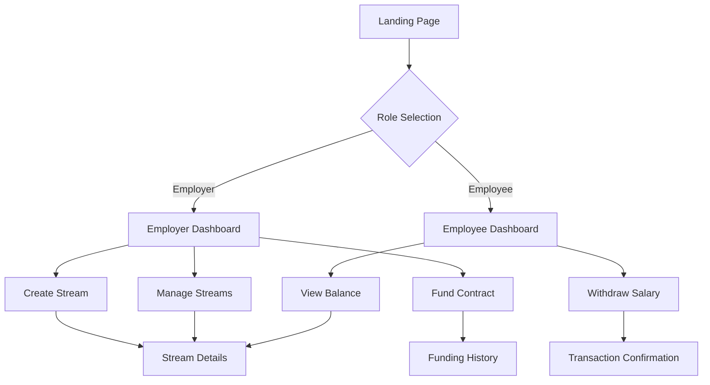

# FHE-Pay Product Requirements Document

## 1. Product Overview

FHE-Pay is a confidential salary streaming dApp that leverages Zama's fhEVM to enable privacy-preserving payroll on Ethereum Sepolia testnet. Employers can fund payroll in crypto while employees receive encrypted salary streams where balances are computed securely using Fully Homomorphic Encryption (FHE).

The product solves the privacy problem in traditional payroll systems by ensuring salary amounts remain encrypted throughout the entire process, from storage to computation to withdrawal, while maintaining full functionality on the blockchain.

## 2. Core Features

### 2.1 User Roles

| Role | Registration Method | Core Permissions |
|------|---------------------|------------------|
| Employer | Wallet connection + role selection | Create salary streams, fund payroll, manage employee streams, view stream analytics |
| Employee | Wallet connection + stream invitation | View encrypted balance, withdraw earned salary, track payment history |

### 2.2 Feature Module

Our FHE-Pay application consists of the following main pages:

1. **Landing Page**: hero section with product overview, wallet connection, role selection, feature highlights
2. **Employer Dashboard**: stream creation form, active streams management, funding interface, analytics overview
3. **Employee Dashboard**: encrypted balance display, withdrawal interface, payment history, stream details
4. **Stream Details Page**: individual stream management, detailed analytics, modification controls
5. **Wallet Connection Page**: multi-wallet support, network switching, FHE key generation

### 2.3 Page Details

| Page Name | Module Name | Feature Description |
|-----------|-------------|---------------------|
| Landing Page | Hero Section | Display product value proposition, privacy benefits, and call-to-action for wallet connection |
| Landing Page | Feature Showcase | Highlight FHE encryption, real-time streaming, and secure withdrawals with visual demonstrations |
| Landing Page | Wallet Connection | Support MetaMask and WalletConnect via RainbowKit with network validation for Sepolia |
| Employer Dashboard | Stream Creation | Create encrypted salary streams with employee address, salary amount (FHE encrypted), and duration settings |
| Employer Dashboard | Active Streams | Display list of active streams with employee info, progress indicators, and management controls |
| Employer Dashboard | Funding Interface | Fund payroll contract with ETH/USDT, view contract balance, and manage funding history |
| Employer Dashboard | Analytics Overview | Show total streams, active employees, total payroll, and withdrawal statistics |
| Employee Dashboard | Encrypted Balance | Display real-time encrypted earned amount with FHE decryption and progress visualization |
| Employee Dashboard | Withdrawal Interface | Secure withdrawal process with FHE proof generation and transaction confirmation |
| Employee Dashboard | Payment History | Track all withdrawals, pending amounts, and stream timeline with encrypted data handling |
| Stream Details | Stream Management | View detailed stream information, modify parameters (if permitted), and pause/resume functionality |
| Stream Details | Progress Tracking | Visual timeline of salary streaming, withdrawal milestones, and remaining duration |
| Stream Details | Security Controls | Emergency pause, access control management, and audit trail for all stream activities |
| Wallet Connection | Multi-Wallet Support | Connect via MetaMask, WalletConnect, and other supported wallets with seamless switching |
| Wallet Connection | FHE Key Management | Generate and manage FHE public/private key pairs for encrypted operations |
| Wallet Connection | Network Validation | Ensure connection to Sepolia testnet with automatic network switching prompts |

## 3. Core Process

**Employer Flow:**
1. Connect wallet and select employer role
2. Generate or import FHE keys for encrypted operations
3. Fund the payroll contract with ETH or USDT
4. Create salary stream by entering employee address, encrypted salary amount, and duration
5. Monitor active streams and manage employee payments
6. View analytics and withdrawal history

**Employee Flow:**
1. Connect wallet and receive stream invitation from employer
2. Generate FHE key pair for encrypted balance operations
3. View encrypted earned balance in real-time
4. Initiate withdrawal with FHE proof generation
5. Confirm transaction and receive salary payment
6. Track payment history and stream progress

## 4. User Interface Design

### 4.1 Design Style

- **Primary Colors**: Deep blue (#1E40AF) for trust and security, bright green (#10B981) for success states
- **Secondary Colors**: Light gray (#F3F4F6) for backgrounds, dark gray (#374151) for text
- **Button Style**: Rounded corners (8px radius) with subtle shadows and hover animations
- **Typography**: Inter font family, 16px base size, with clear hierarchy (24px headings, 14px captions)
- **Layout Style**: Card-based design with clean spacing, top navigation with breadcrumbs
- **Icons**: Heroicons for consistency, lock icons for encryption features, shield icons for security
- **Animations**: Subtle fade-ins, loading spinners for FHE operations, progress bars for streaming

### 4.2 Page Design Overview

| Page Name | Module Name | UI Elements |
|-----------|-------------|-------------|
| Landing Page | Hero Section | Large heading with gradient text, animated background, prominent CTA button with wallet icons |
| Landing Page | Feature Cards | Three-column grid with FHE encryption, streaming, and security icons, hover effects |
| Employer Dashboard | Stream Creation | Modal form with input validation, encrypted amount field with lock icon, duration slider |
| Employer Dashboard | Active Streams | Data table with progress bars, status badges (active/paused), action buttons (view/edit/pause) |
| Employee Dashboard | Balance Display | Large encrypted balance card with decrypt button, progress circle, and time remaining |
| Employee Dashboard | Withdrawal Form | Amount input with max button, gas estimation, confirmation modal with transaction details |
| Stream Details | Progress Timeline | Horizontal timeline with milestones, withdrawal markers, and remaining duration indicator |
| Wallet Connection | Connection Options | Grid of wallet options with logos, connection status indicators, and network badges |

### 4.3 Responsiveness

The application is designed mobile-first with responsive breakpoints at 768px (tablet) and 1024px (desktop). Touch interactions are optimized for mobile devices with larger tap targets (44px minimum) and swipe gestures for navigation. The layout adapts from single-column on mobile to multi-column grids on larger screens.

## 5. Technical Requirements

### 5.1 Smart Contract Requirements

- Implement PayrollStream contract using fhEVM Solidity library
- Support euint256 encrypted salary amounts with FHE arithmetic operations
- Include reentrancy guards and access control mechanisms
- Implement emergency pause functionality for security
- Support async decryption for balance queries
- Gas optimization for frequent operations

### 5.2 Frontend Requirements

- Next.js 14 with TypeScript for type safety
- RainbowKit integration for wallet connections
- Wagmi hooks for contract interactions
- TailwindCSS for responsive styling
- FHE SDK integration for client-side encryption
- Real-time balance updates using polling or events
- Error handling for failed FHE operations

### 5.3 Security Requirements

- Client-side FHE key generation and secure storage
- Input validation for all user inputs
- Secure handling of encrypted data
- Protection against common smart contract vulnerabilities
- HTTPS enforcement for all communications
- Audit trail for all critical operations

## 6. Performance Requirements

- Page load times under 3 seconds on 3G networks
- FHE encryption operations complete within 5 seconds
- Balance updates refresh every 30 seconds
- Support for up to 100 concurrent streams per employer
- Transaction confirmation within 2 minutes on Sepolia
- Mobile responsiveness with smooth animations at 60fps

## 7. Integration Requirements

### 7.1 Blockchain Integration

- Sepolia testnet deployment with fhEVM support
- Integration with Zama's FHE gateway for async operations
- Support for ETH and USDT token payments
- Event listening for real-time updates
- Transaction status tracking and error handling

### 7.2 Wallet Integration

- MetaMask integration with custom network addition
- WalletConnect v2 support for mobile wallets
- Hardware wallet support (Ledger, Trezor)
- Account switching and multi-account support
- Signature verification for FHE operations

## 8. Testing Requirements

### 8.1 Smart Contract Testing

- Unit tests for all contract functions
- Integration tests with fhEVM operations
- Gas usage optimization tests
- Security vulnerability testing
- Edge case handling (zero amounts, expired streams)

### 8.2 Frontend Testing

- Component unit tests with React Testing Library
- Integration tests for wallet connections
- E2E tests for complete user flows
- FHE operation testing with mock data
- Cross-browser compatibility testing

## 9. Deployment Requirements

### 9.1 Smart Contract Deployment

- Automated deployment scripts with Hardhat
- Contract verification on Sepolia Etherscan
- Multi-signature deployment for production
- Upgrade proxy pattern for future updates
- Environment-specific configuration management

### 9.2 Frontend Deployment

- Vercel deployment with automatic builds
- Environment variable management
- CDN optimization for static assets
- SSL certificate configuration
- Performance monitoring and analytics

## 10. Documentation Requirements

- Comprehensive README with setup instructions
- API documentation for smart contract functions
- User guide with screenshots and tutorials
- Developer documentation for FHE integration
- Security best practices guide
- Troubleshooting guide for common issues