# FHE-Pay Technical Architecture Document

## 1. Architecture Design


## 2. Technology Description

- Frontend: Next.js@14 + TypeScript + TailwindCSS + RainbowKit + Wagmi
- Smart Contracts: Solidity + fhEVM-solidity library
- Blockchain: Sepolia Testnet (Ethereum)
- FHE Library: Zama's fhEVM SDK
- Development Tools: Hardhat + TypeScript
- Testing: Hardhat + Chai + fhEVM test utilities

## 3. Route Definitions

| Route | Purpose |
|-------|----------|
| / | Landing page with project overview and wallet connection |
| /employer | Employer dashboard for creating and managing salary streams |
| /employee | Employee dashboard for viewing encrypted balance and withdrawals |
| /stream/[id] | Individual stream details and management |
| /connect | Wallet connection and role selection page |

## 4. API Definitions

### 4.1 Smart Contract Interface

**PayrollStream Contract**

```solidity
// Create encrypted salary stream
function createStream(
    address employee,
    bytes calldata encryptedSalaryAmount,
    uint256 duration,
    bytes32 publicKey
) external payable
```

Parameters:
| Param Name | Param Type | isRequired | Description |
|------------|------------|------------|--------------|
| employee | address | true | Employee wallet address |
| encryptedSalaryAmount | bytes | true | FHE encrypted salary amount |
| duration | uint256 | true | Stream duration in seconds |
| publicKey | bytes32 | true | Employee's FHE public key |

```solidity
// Withdraw earned salary
function withdrawSalary(
    uint256 streamId,
    bytes calldata proof
) external
```

Parameters:
| Param Name | Param Type | isRequired | Description |
|------------|------------|------------|--------------|
| streamId | uint256 | true | Unique stream identifier |
| proof | bytes | true | FHE decryption proof |

```solidity
// Get encrypted earned amount
function getEncryptedEarnedAmount(
    uint256 streamId
) external view returns (bytes memory)
```

Response:
| Param Name | Param Type | Description |
|------------|------------|-------------|
| encryptedAmount | bytes | FHE encrypted earned amount |

### 4.2 Frontend API Types

```typescript
interface SalaryStream {
  id: string;
  employer: string;
  employee: string;
  encryptedSalaryAmount: string;
  duration: number;
  startTime: number;
  withdrawn: boolean;
  active: boolean;
}

interface EncryptedBalance {
  streamId: string;
  encryptedAmount: string;
  lastUpdated: number;
}

interface FHEDecryptionResult {
  decryptedAmount: bigint;
  proof: string;
  timestamp: number;
}
```

## 5. Server Architecture Diagram


## 6. Data Model

### 6.1 Data Model Definition

```mermaid
erDiagram
    PAYROLL_STREAM {
        uint256 id PK
        address employer
        address employee
        euint256 encryptedSalaryAmount
        uint256 duration
        uint256 startTime
        uint256 totalWithdrawn
        bool active
        bytes32 employeePublicKey
    }
    
    WITHDRAWAL_HISTORY {
        uint256 id PK
        uint256 streamId FK
        uint256 amount
        uint256 timestamp
        bytes32 transactionHash
    }
    
    FHE_KEYS {
        address user PK
        bytes32 publicKey
        uint256 createdAt
        bool active
    }
    
    PAYROLL_STREAM ||--o{ WITHDRAWAL_HISTORY : has
    PAYROLL_STREAM ||--|| FHE_KEYS : uses
```



### 6.2 Smart Contract Data Structures

**PayrollStream Contract Storage**

```solidity
// SPDX-License-Identifier: MIT
pragma solidity ^0.8.19;

import "fhevm/lib/TFHE.sol";
import "fhevm/gateway/GatewayCaller.sol";

contract PayrollStream is GatewayCaller {
    using TFHE for euint256;
    
    struct Stream {
        address employer;
        address employee;
        euint256 encryptedSalaryAmount;
        uint256 duration;
        uint256 startTime;
        uint256 totalWithdrawn;
        bool active;
        bytes32 employeePublicKey;
    }
    
    struct WithdrawalRequest {
        uint256 streamId;
        address employee;
        uint256 requestTime;
        bool processed;
    }
    
    // State variables
    mapping(uint256 => Stream) public streams;
    mapping(address => uint256[]) public employerStreams;
    mapping(address => uint256[]) public employeeStreams;
    mapping(uint256 => WithdrawalRequest) public withdrawalRequests;
    
    uint256 public nextStreamId;
    uint256 public nextWithdrawalId;
    
    // Events
    event StreamCreated(
        uint256 indexed streamId,
        address indexed employer,
        address indexed employee,
        uint256 duration
    );
    
    event SalaryWithdrawn(
        uint256 indexed streamId,
        address indexed employee,
        uint256 amount
    );
    
    event WithdrawalRequested(
        uint256 indexed requestId,
        uint256 indexed streamId,
        address indexed employee
    );
}
```

**FHE Key Management**

```solidity
// User FHE key registration
mapping(address => bytes32) public userPublicKeys;
mapping(address => bool) public keyRegistered;

function registerFHEKey(bytes32 publicKey) external {
    userPublicKeys[msg.sender] = publicKey;
    keyRegistered[msg.sender] = true;
}
```

**Encrypted Balance Calculation**

```solidity
function calculateEncryptedEarned(
    uint256 streamId
) internal view returns (euint256) {
    Stream storage stream = streams[streamId];
    
    // Calculate time elapsed
    uint256 timeElapsed = block.timestamp - stream.startTime;
    if (timeElapsed > stream.duration) {
        timeElapsed = stream.duration;
    }
    
    // Calculate earned amount using FHE operations
    euint256 timeRatio = TFHE.asEuint256(timeElapsed * 1e18 / stream.duration);
    euint256 earnedAmount = TFHE.mul(stream.encryptedSalaryAmount, timeRatio);
    earnedAmount = TFHE.div(earnedAmount, TFHE.asEuint256(1e18));
    
    return earnedAmount;
}
```

## 7. Security Architecture

### 7.1 FHE Security Measures

- **Client-side Encryption**: All salary amounts encrypted before sending to contract
- **Key Management**: Secure FHE key generation and storage
- **Proof Verification**: Withdrawal proofs validated on-chain
- **Access Control**: Role-based permissions for employers and employees

### 7.2 Smart Contract Security

```solidity
// Reentrancy protection
modifier nonReentrant() {
    require(!_locked, "ReentrancyGuard: reentrant call");
    _locked = true;
    _;
    _locked = false;
}

// Access control
modifier onlyStreamParticipant(uint256 streamId) {
    Stream storage stream = streams[streamId];
    require(
        msg.sender == stream.employer || msg.sender == stream.employee,
        "Not authorized"
    );
    _;
}

// Emergency pause
modifier whenNotPaused() {
    require(!paused, "Contract is paused");
    _;
}
```

### 7.3 Frontend Security

- **Wallet Security**: Secure wallet connection via RainbowKit
- **Input Validation**: Client-side validation before encryption
- **Error Handling**: Secure error messages without sensitive data exposure
- **HTTPS Only**: All communications over secure channels

## 8. Deployment Strategy

### 8.1 Sepolia Testnet Deployment

```javascript
// hardhat.config.ts
const config: HardhatUserConfig = {
  solidity: {
    version: "0.8.19",
    settings: {
      optimizer: {
        enabled: true,
        runs: 200,
      },
    },
  },
  networks: {
    sepolia: {
      url: process.env.SEPOLIA_RPC_URL,
      accounts: [process.env.PRIVATE_KEY!],
      chainId: 11155111,
    },
  },
  fhevm: {
    network: "sepolia",
    gateway: process.env.FHEVM_GATEWAY_URL,
  },
};
```

### 8.2 Contract Verification

```bash
# Deploy and verify contract
npx hardhat run scripts/deploy.ts --network sepolia
npx hardhat verify --network sepolia <CONTRACT_ADDRESS>
```

## 9. Testing Strategy

### 9.1 Smart Contract Testing

```javascript
// Test encrypted operations
describe("PayrollStream FHE Operations", function () {
  it("Should create encrypted salary stream", async function () {
    const encryptedAmount = await fhevm.encrypt(ethers.parseEther("1000"));
    const tx = await payrollStream.createStream(
      employee.address,
      encryptedAmount,
      30 * 24 * 60 * 60, // 30 days
      employeePublicKey
    );
    
    expect(tx).to.emit(payrollStream, "StreamCreated");
  });
  
  it("Should calculate encrypted earned amount", async function () {
    // Fast forward time
    await time.increase(15 * 24 * 60 * 60); // 15 days
    
    const encryptedEarned = await payrollStream.getEncryptedEarnedAmount(1);
    const decryptedEarned = await fhevm.decrypt(encryptedEarned);
    
    expect(decryptedEarned).to.equal(ethers.parseEther("500")); // Half salary
  });
});
```

### 9.2 Frontend Testing

```javascript
// Component testing with FHE operations
import { render, screen, waitFor } from '@testing-library/react';
import { EmployeeDashboard } from '../components/EmployeeDashboard';

test('displays encrypted balance correctly', async () => {
  const mockStream = {
    id: '1',
    encryptedSalaryAmount: 'encrypted_data',
    duration: 30 * 24 * 60 * 60,
  };
  
  render(<EmployeeDashboard stream={mockStream} />);
  
  await waitFor(() => {
    expect(screen.getByText(/Encrypted Balance/)).toBeInTheDocument();
  });
});
```

## 10. File Structure

```
fhe-pay/
├── contracts/
│   ├── PayrollStream.sol
│   ├── interfaces/
│   │   └── IPayrollStream.sol
│   └── libraries/
│       └── FHEUtils.sol
├── scripts/
│   ├── deploy.ts
│   └── verify.ts
├── test/
│   ├── PayrollStream.test.ts
│   └── fixtures/
├── frontend/
│   ├── src/
│   │   ├── components/
│   │   │   ├── EmployerDashboard.tsx
│   │   │   ├── EmployeeDashboard.tsx
│   │   │   ├── StreamCard.tsx
│   │   │   └── WalletConnect.tsx
│   │   ├── hooks/
│   │   │   ├── useContract.ts
│   │   │   ├── useFHE.ts
│   │   │   └── useStreams.ts
│   │   ├── contexts/
│   │   │   ├── Web3Context.tsx
│   │   │   └── FHEContext.tsx
│   │   ├── utils/
│   │   │   ├── fhe.ts
│   │   │   ├── contract.ts
│   │   │   └── formatting.ts
│   │   └── pages/
│   │       ├── index.tsx
│   │       ├── employer.tsx
│   │       ├── employee.tsx
│   │       └── stream/[id].tsx
│   ├── public/
│   ├── package.json
│   └── next.config.js
├── hardhat.config.ts
├── package.json
└── README.md
```